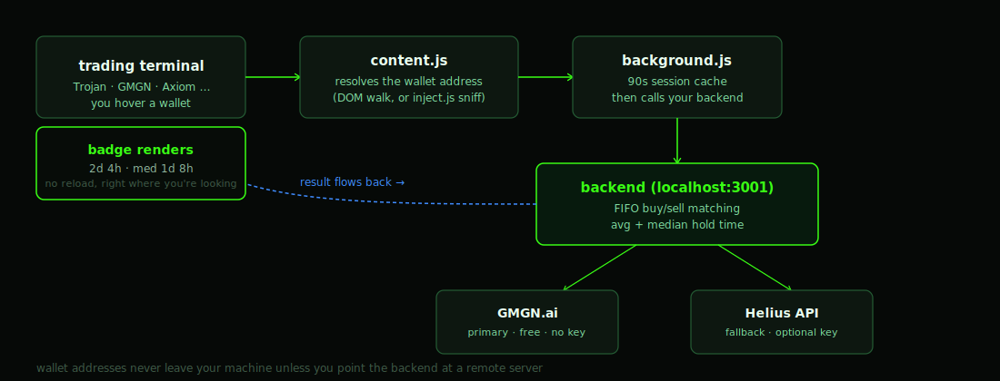

# wall.io


**Hover a wallet. See how long it actually holds.**

[](LICENSE)
[](https://developer.chrome.com/docs/extensions/mv3/intro/)
[](https://solana.com/)
[](PRIVACY.md)

Every trading terminal shows you a wallet's PnL. None of them tell you the thing that actually predicts what happens next: **does this wallet hold, or does it dump the second it's in profit?** wall.io answers that in the time it takes to hover — no dashboard, no copy-paste, no second tab.

It runs the raw on-chain swap history through amount-aware FIFO lot accounting to compute real average *and* median hold time, then drops a badge right next to the address you're already looking at. Everything stays on your machine — the backend is yours, the wallet lookups never touch anyone's servers but GMGN's and (optionally) Helius's.

---

## See it in action

<table>
<tr>
<td width="50%">

**The badge**

Hover any wallet on a supported terminal. Avg and median hold time, color-coded, updating live as you switch the lookback window.


</td>
<td width="50%">

**The style editor**

Five built-in presets or full manual control — color, layout, typography, glow. Applies instantly to every open terminal tab.


</td>
</tr>
</table>

<p align="center">
  
</p>

*(Drop your own captures into `assets/screenshots/` under these three filenames — `badge-hover.png`, `style-editor.png`, `splash.png` — and they'll render here automatically. See `STORE-LISTING.md` for the full capture checklist used for the Chrome Web Store listing.)*

## How it works



A hover resolves a wallet address client-side, your local backend pulls that wallet's swap history from GMGN (falling back to Helius if GMGN is rate-limited or Cloudflare-blocked), runs FIFO buy/sell matching per token, and the result renders as a badge — typically well under a second on a warm cache.

## What the badge shows

- **Average hold time** — mean duration between a buy and its matched sell, amount-aware FIFO lot accounting
- **Median hold time** — the honest middle, not skewed by one outlier trade
- **Selectable window** — 1D / 3D / 7D / 30D, switchable with a single keypress, no menu required
- **Color coding** — green (4h+, tends to hold) · yellow (1–4h, flips) · red (under 1h, dumps fast)
- **Search on X** — one click straight to a live search for that address

## Quick start

New to this? Read [`SETUP.md`](SETUP.md) for a non-technical walkthrough.

**1. Load the extension**

1. Download this repo
2. Open `chrome://extensions`
3. Enable Developer mode (top-right toggle)
4. Click "Load unpacked"
5. Select the `extension/` folder

**2. Start the backend**

```bash
cd backend
npm install
npm start
```

Or run `start-windows.bat` (Windows) / `start-mac.command` (Mac) directly.

**3. Use it**

Open any supported terminal and hover a wallet address. The badge appears automatically once the backend is running.

## Supported terminals

Trojan, GMGN, Axiom, Padre, DexScreener, Pump.fun, Raydium, Jupiter, Meteora, Birdeye, Solscan, and Solana Explorer.

Detection method varies by site — DOM data attributes on most, WebSocket sniffing via `inject.js` on Axiom. `manifest.json` is the source of truth for the exact URL match list.

## Keyboard shortcuts

| Key | Action |
|-----|--------|
| `1` | 1D window |
| `3` | 3D window |
| `7` | 7D window |
| `0` | 30D window |
| `Esc` | Close the badge |

## Badge style editor

The popup includes a live style editor with five built-in presets — Default, Neon, Stealth, Crimson, Ocean — and full manual control over color, layout, typography, and shadow/glow effects. Changes apply immediately to any open terminal tab; no reload required.

## Project structure

```
wall-badge-FINAL/
  assets/
    banner.svg              README hero banner
    flow.svg                 hover-to-badge data flow diagram
    screenshots/            real captures (see "See it in action")
  extension/
    manifest.json        MV3 config, site permissions
    content.js            hover detection + tooltip (isolated world)
    inject.js              passive WebSocket wallet sniffer (MAIN world)
    background.js        backend proxy
    style-config.js       badge defaults, presets, CSS generator
    badge.css              fallback badge styling
    popup.html / popup.js  period picker + style editor
    icons/                  16/48/128px
  backend/
    server.js               Node.js backend (GMGN + Helius fallback)
    package.json
    start-windows.bat       one-click start (Windows)
    start-mac.command       one-click start (Mac)
    .env.example             optional Helius API key
  README.md
  SETUP.md                  non-technical walkthrough
  PRIVACY.md
  LICENSE
```

## Backend

The backend pulls wallet swap history from GMGN.ai (free, no API key required) and falls back to the Helius API when GMGN is rate-limited or blocked by a Cloudflare challenge (optional free key from [helius.dev](https://helius.dev)).

- Detects Cloudflare challenges and falls back to Helius immediately rather than hanging
- 10-second hard timeout on any single lookup
- Filters out plain transfers — only counts actual DEX swaps
- Per-wallet FIFO cache with a 90-second TTL
- Computes both mean and median hold time, from a single matched trade upward

## Privacy

No account, no login, no analytics. The extension stores only an anonymous install ID locally on your device. Wallet addresses you look up are sent to your own backend — localhost by default — and nothing leaves your machine unless you deliberately point the backend setting at a remote server. Full details in [`PRIVACY.md`](PRIVACY.md).

## License

[MIT](LICENSE)
